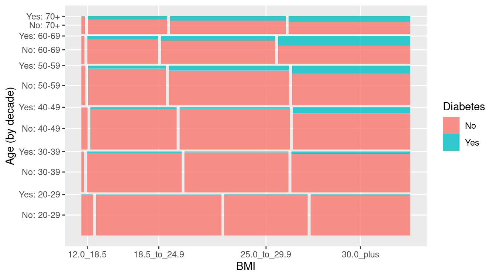
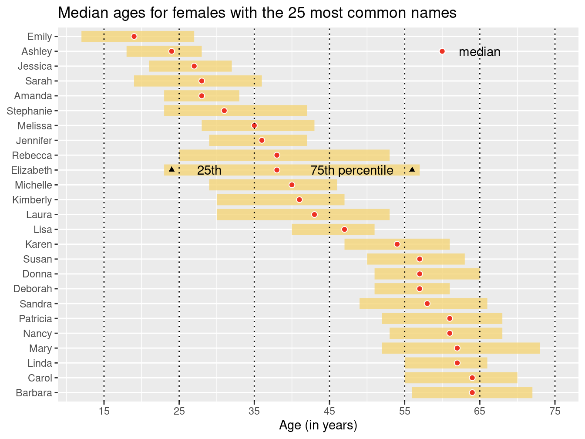

```{r setup, include=FALSE}
knitr::opts_chunk$set(echo = TRUE, eval = TRUE, fig.width=6, fig.height=4, out.width = "70%", fig.align = "center") 
```

## Prerequisite: Loading packages

```{r, warning = FALSE, message = FALSE}
library(mdsr) 
library(tidyverse)
```

The `mdsr` package for `R` contains all of the data sets referenced in this note. In particular, loading `mdsr` also loads the `mosaic` package, which in turn loads `dplyr` and `ggplot2`. The `mosaic` package includes data sets and utilities from Project MOSAIC (<http://mosaic-web.org>) that are used to teach mathematics, statistics, computation and modeling. Packages `dplyr` and `ggplot2` are part of `tidyverse`. 

The `tidyverse` (https://www.tidyverse.org/) is an opinionated collection of R packages designed for data science, managed by a group of people including Hadley Wickham, statistician and chief scientist at RStudio, Inc. See the excerpt of the Tidyverse slides at [Tidyverse Slide](Tidyverse-intro.pdf). 

## 1. ggplot2 

The `ggplot2` package is the primary tool of data visualization, and implements *the grammar of graphics* in the book "The Grammar of Graphics" by Leland Wilkinson, now chief scientist at [h2o, Inc](https://www.h2o.ai/). The four elements of graphics identified by Yau (Visual Cues, Coordinate System, Scale and Context) are also found in the grammar of graphics, albeit by different terms. Thus, it is essential to understand the taxonomy of graphics in order to use `ggplot2`. 
 

### `ggplot2::mpg` data example

We will follow the examples in [*R for data science*](http://r4ds.had.co.nz/data-visualisation.html). Let's first look at the data set. `mpg` contains observations collected by the US Environment Protection Agency on 38 models of car. `mpg` is a `tibble`, which is a simplified `data.frame`, modified for better handling large data. For now, it is okay to think a `tibble` as a `data.frame`. 


```{r}
class(mpg)
mpg
```


Among the variables in `mpg` are:

1. `displ`, a car's engine size, in litres.

2. `hwy`, a car's fuel efficiency on the highway, in miles per gallon (mpg). A car with a low fuel efficiency consumes more fuel than a car with a high fuel efficiency when they travel the same distance.

To learn more about `mpg`, open its help page by running `?mpg`.

### Creating a ggplot

To plot `mpg`, run this code to put `displ` on the x-axis and `hwy` on the y-axis:

```{r}
ggplot(data = mpg) + 
  geom_point(mapping = aes(x = displ, y = hwy))
```

With ggplot2, you begin a plot with the function `ggplot()`. `ggplot()` creates a coordinate system that you can add layers to. The first argument of `ggplot()` is the dataset to use in the graph. So `ggplot(data = mpg)` creates an empty graph.

You complete your graph by adding one or more layers to `ggplot()`. The function `geom_point()` adds a layer of points to your plot, which creates a scatterplot. ggplot2 comes with many geom functions that each add a different type of layer to a plot.  

Each geom function in ggplot2 takes a `mapping` argument. This defines how variables in your dataset are mapped to visual properties. The `mapping` argument is always paired with `aes()`, and the `x` and `y` arguments of `aes()` specify which variables to map to the x and  y axes. ggplot2 looks for the mapped variable in the data argument, in this case, `mpg`.

In connection to the four elements of data graphics, 

1. `ggplot()` (by default) sets the coordinate system as the *Cartesian coordinate system*;

2. Visual cue used is the *position*, set by `mapping = aes(x = ..., y = ...)`, paired with the use of `geom_point()`;

3. *scale* is automatically chosen as appropriate as possible;  

4. *context* is (minimally) given by the axis labels.

### A graphing template

To make a graph, replace the bracketed sections in the code below with a dataset, a geom function, or a collection of mappings.

```{r eval = FALSE}
ggplot(data = <DATA>) + 
  <GEOM_FUNCTION>(mapping = aes(<MAPPINGS>))
```

### Adding more visual cues 

You can add a third variable, like `class`, to a two dimensional scatterplot by mapping it to an aesthetic. An aesthetic is a visual property of the objects in your plot. Aesthetics include things like the size, the shape, or the color of your points.

You can convey information about your data by mapping the aesthetics in your plot to the variables in your dataset. For example, you can map the colors of your points to the class variable to reveal the `class` of each car.


```{r}
ggplot(data = mpg) + 
  geom_point(mapping = aes(x = displ, y = hwy, color = class))
```

Try mapping the `class` variable using the visual cues `size`, `shape`, or `alpha` (transparency), `fill` (with set `shape = 22`) . 

```{r eval = FALSE}
g <- ggplot(data = mpg, mapping = aes(x = displ, y = hwy))
g + geom_point(mapping = aes(size = class))
g + geom_point(mapping = aes(shape = class))
g + geom_point(mapping = aes(alpha = class))
g + geom_point(mapping = aes(fill = class), shape = 22)
```
Your visual cue is the aesthetic, and must be mapped to graphics by `aes()`. You can also *set* the aesthetic properties of your geom manually. For example, we can make all of the points in our plot blue with square shape:

```{r}
ggplot(data = mpg) + 
  geom_point(mapping = aes(x = displ, y = hwy), color = "blue", shape = 15)
```

Here, the color doesn't convey information about a variable, but only changes the appearance of the plot. To set an aesthetic manually, set the aesthetic by name as an argument of your geom function; i.e. it goes *outside* of `aes()`. 

Listing all available colors, shapes, linetypes, etc, is out of scope of this course. Web references include [Cookbook for R](http://www.cookbook-r.com/Graphs/Shapes_and_line_types/) and Tian Zheng's ["Colors in R"](http://www.stat.columbia.edu/~tzheng/files/Rcolor.pdf). 
The ColorBrewer scales are also useful and documented online at http://colorbrewer2.org/ and made available in R via the `RColorBrewer` package, by Erich Neuwirth. 
It is very possible things may change rapidly, I generally recommend googling "R shape codes", "R color codes", etc, for reference. 

###  Facets

One way to add additional variables is with aesthetics. Another way, particularly useful for categorical variables, is to split your plot into facets, subplots that each display one subset of the data.

To facet your plot by a single variable, use `facet_wrap()`. The first argument of `facet_wrap()` should be a formula, which you create with `~` followed by a variable name (here "formula" is the name of a data structure in R, not a synonym for "equation"). The variable that you pass to `facet_wrap()` should be discrete.

```{r}
g <- ggplot(data = mpg) + 
  geom_point(mapping = aes(x = displ, y = hwy))
g + facet_wrap(~ class, nrow = 2)
```

To facet your plot on the combination of two variables, add `facet_grid()` to your plot call. The first argument of `facet_grid()` is also a formula. This time the formula should contain two variable names separated by a `~`.

```{r}
g + facet_grid(drv ~ cyl)
```

See that I am not retyping `ggplot(data = mpg) + geom_point(mapping = aes(x = displ, y = hwy))`. The result was already stored in the R object `g` and you can simply reuse it. 

Finally, use facet_grid() to facet into columns (or rows) based on `drv`

```{r eval = FALSE}
g + facet_grid(. ~ drv)
g + facet_grid(drv ~ . )
``` 


### Geometric objects

```{r, out.width = "50%", fig.align = "default", fig.show='hold'}

# left
ggplot(data = mpg) + 
  geom_point(mapping = aes(x = displ, y = hwy))

# right
ggplot(data = mpg) + 
  geom_smooth(mapping = aes(x = displ, y = hwy))
```

A **geom** is the geometrical object that a plot uses to represent data. People often describe plots by the type of geom that the plot uses. For example, bar charts use bar geoms, line charts use line geoms, boxplots use boxplot geoms, and so on. Scatterplots break the trend; they use the point geom. As we see above, you can use different geoms to plot the same data. The plot on the left uses the point geom, and the plot on the right uses the smooth geom, a smooth line fitted to the data.

Every geom function in ggplot2 takes a `mapping` argument. However, not every aesthetic works with every geom. You could set the shape of a point, but you couldn't set the "shape" of a line. On the other hand, you could set the linetype of a line. `geom_smooth()` will draw a different line, with a different `linetype`, for each unique value of the variable that you map to linetype.

```{r, message = FALSE}
ggplot(data = mpg) + 
  geom_smooth(mapping = aes(x = displ, y = hwy, linetype = drv))
```
 
To display multiple geoms in the same plot, add multiple geom functions to `ggplot()`:

```{r, message = FALSE}
ggplot(data = mpg) + 
  geom_point(mapping = aes(x = displ, y = hwy)) +
  geom_smooth(mapping = aes(x = displ, y = hwy))
``` 
 
This, however, introduces some duplication in our code. Imagine if you wanted to change the y-axis to display `cty` instead of `hwy`. You'd need to change the variable in two places, and you might forget to update one. You can avoid this type of repetition by passing a set of mappings to `ggplot()`. ggplot2 will treat these mappings as global mappings that apply to each geom in the graph. In other words, this code will produce the same plot as the previous code:

```{r, message = FALSE}
ggplot(data = mpg, mapping = aes(x = displ, y = hwy)) + 
  geom_point() + 
  geom_smooth()
```

If you place mappings in a geom function, ggplot2 will treat them as local mappings for the layer. It will use these mappings to extend or overwrite the global mappings for that layer only. This makes it possible to display different aesthetics in different layers.

```{r}
ggplot(data = mpg, mapping = aes(x = displ, y = hwy)) + 
  geom_point(mapping = aes(color = class)) + 
  geom_smooth(method = "lm", se = FALSE) # We've been using method = "loess"
```


Think about this:

1. What geom would you use to draw a line chart? A boxplot? A histogram? An area chart?

2. What aesthetics can you use to each geom? 
  
To get answers, `Help > Cheatsheets > Data Visualization with ggplot2`

### Adding context by labels

The easiest place to start when turning an exploratory graphic into an expository graphic is with good labels. You add labels with the labs() function. This example adds a plot title:

```{r, message=FALSE}
ggplot(mpg, aes(displ, hwy)) +
  geom_point(aes(color = class)) +
  geom_smooth(se = FALSE) +
  labs(
    title = "Fuel efficiency generally decreases with engine size",
    subtitle = "Two seaters (sports cars) are an exception because of their light weight",
    caption = "Data from fueleconomy.gov"
  )
```


You can also use `labs()` to replace the axis and legend titles. It’s usually a good idea to replace short variable names with more detailed descriptions, and to include the units.

```{r, message=FALSE}
ggplot(mpg, aes(displ, hwy)) +
  geom_point(aes(colour = class)) +
  geom_smooth(se = FALSE) +
  labs(
    x = "Engine displacement (L)",
    y = "Highway fuel economy (mpg)",
    colour = "Car type"
  )
```

Context is also provided by guides (more commonly called legends). By mapping a discrete variable to one of the visual cues of shape, color or linetype, ggplot2 by default creates a legend. The `geom_text()` and `geom_annotate()` functions can also be used to provide specific textual annotations on the plot. We will see this in the lab activity. 

### Scales
 
It's very useful to plot transformations of your variable. To elucidate this idea, let's use `diamond` dataset which comes in ggplot2 and contains information about ~54,000 diamonds, including the `price`, `carat`, `color`, `clarity`, and `cut` of each diamond. It's easier to see the precise relationship between carat and price if we log transform them:

```{r, out.width = "50%", fig.align = "default", fig.show='hold'}
ggplot(diamonds, aes(carat, price)) +
  geom_bin2d()
ggplot(diamonds, aes(log10(carat), log10(price))) +
  geom_bin2d()
```

However, the disadvantage of this transformation is that the axes are now labelled with the transformed values, making it hard to interpret the plot. Instead of doing the transformation in the aesthetic mapping, we can instead do it with the scale. This is visually identical, except the axes are labelled on the original data scale.

```{r}
ggplot(diamonds, aes(carat, price)) +
  geom_bin2d() + 
  scale_x_log10() + 
  scale_y_log10()
```

Here's an identical graph using `scale_y_continuous()` function:

```{r, eval = FALSE}
ggplot(diamonds, aes(carat, price)) +
  geom_bin2d() + 
  scale_x_continuous(trans = "log10") + 
  scale_y_continuous(trans = "log10")
```

Another scale that is frequently customised is colour. Below, `"Set1"` is defined in `RColorBrewer` package; see Figure 2.11 in MDSR (textbook).

```{r, out.width = "50%", fig.align = "default", fig.show='hold'}
ggplot(mpg, aes(displ, hwy)) +
  geom_point(aes(color = drv))

ggplot(mpg, aes(displ, hwy)) +
  geom_point(aes(color = drv)) +
  scale_colour_brewer(palette = "Set1")
```
 

### Statistical transformations

Next, let's take a look at a bar chart. Bar charts seem simple, but they are interesting because they reveal something subtle about plots. Consider a basic bar chart, as drawn with `geom_bar()`

```{r}
ggplot(data = diamonds) + 
  geom_bar(mapping = aes(x = cut))
```

On the x-axis, the chart displays `cut`, a variable from `diamonds`. On the y-axis, it displays count, but count is not a variable in `diamonds`! Where does count come from? Many graphs, like scatterplots, plot the raw values of your dataset. Other graphs, like bar charts, calculate new values to plot:

- bar charts, histograms, and frequency polygons bin your data and then plot bin counts (`geom_bar()` and  `geom_bin2d()`)

- smoothers fit a model to your data and then plot predictions from the model (`geom_smooth()`)

The algorithm used to calculate new values for a graph is called a `stat`, short for statistical transformation. The figure below describes how this process works with `geom_bar()`.


You can learn which stat a geom uses by inspecting the default value for the stat argument. For example, `?geom_bar` shows that the default value for stat is `count`, which means that `geom_bar()` uses `stat_count()`. `stat_count()` is documented on the same page as  `geom_bar()`, and if you scroll down you can find a section called **Computed variables**. That describes how it computes two new variables: `count` and `prop`.


You can generally use geoms and stats interchangeably. For example, you can recreate the previous plot using `stat_count()` instead of `geom_bar()`:

```{r, eval = FALSE}
ggplot(data = diamonds) + 
  stat_count(mapping = aes(x = cut))
```  
 
This works because every geom has a default stat; and every stat has a default geom. You might want to override the default mapping from transformed variables to aesthetics. 

```{r}
ggplot(data = diamonds) + 
  geom_bar(mapping = aes(x = cut, y = ..prop.., group = 1)) 
```

`group="whatever"` is a "dummy" grouping to override the default behavior, which is to group by the x variable `cut` (in this example). The default for geom_bar is to group by the x variable in order to separately count the number of rows in each level of the x variable. To compute the proportion of each level of `cut` among all, we do not want to group by `cut`. Sepecifying a dummy group `group = 1`, i.e. all are in `group 1`, achieves this. 


When there is no need for any statistical transformation, I can change the `stat` of `geom_bar()` from count (the default) to identity, as shown in the example below. 

```{r, warning = FALSE}
library(tibble)
demo <- tribble(
  ~cut,         ~freq,
  "Fair",       1610,
  "Good",       4906,
  "Very Good",  12082,
  "Premium",    13791,
  "Ideal",      21551
)

ggplot(data = demo) +
  geom_bar(mapping = aes(x = reorder(cut,freq), y = freq), stat = "identity") 
# see what happens if `reorder(cut,freq)` is replaced by `cut`. Type `head(diamonds$cut)`
```


```{r}
ggplot(data = demo) +
  geom_col(mapping = aes(x = reorder(cut,freq), y = freq)) 
```

Let us browse some other aesthetic options in `geom_bar()`. You can colour a bar chart using either the `color` aesthetic, or, more usefully, `fill`:

```{r, warning = FALSE}
ggplot(data = diamonds) + 
  geom_bar(mapping = aes(x = cut, fill = cut))
```

It is of course more useful when `fill` aesthetic is mapped to another categorical variable, like `clarity`. 

```{r, message=FALSE, warning = FALSE}
library(dplyr)
diamondss <- diamonds %>% filter(color %in% c('D','E','F')) # don't worry about this for now
g <- ggplot(data = diamondss, mapping = aes(x = cut, fill = color)) 
g + geom_bar() 
```
The stacking is performed automatically by the position adjustment specified by the position argument. If you don't want a stacked bar chart, you can use one of three other options: `"identity"`, `"dodge"` or `"fill"`.

```{r, out.width = "30%", fig.align = "default", fig.show='hold'}
g + geom_bar(alpha = 1/5, position = "identity")
g + geom_bar(position = "fill")
g + geom_bar(position = "dodge")
```


### Saving your plots

```{r eval = FALSE}
ggsave("my-plot.pdf")
```


## 2. A grammer for data graphics

In this lab, we will follow Section 3 "A Grammar for Graphics".

```{r, message = FALSE}
library(mdsr)
library(tidyverse)
```

We will use `CIACountries` data set that includes measures that are relevant to answer questions about economic productivity.

```{r, echo = FALSE}
head(CIACountries)
```

Using **ggplot2**, we will plot `educ` variable in horizontal coordinate while plotting `gdp` variable in vertical coordinate.

```{r}
g <- ggplot(data = CIACountries, aes(y = gdp, x = educ))
g + geom_point(size = 3)
```

Note that every dot has the same shape and size. However, it is possible to add third categorical variable on the plot. We will extend the previous example by mapping the color of each dot to the categorical `net_users` variable.

```{r}
g + geom_point(aes(color = net_users), size = 3)
```

We can also plot text rather than plotting a dot.

```{r}
g + geom_text(aes(label = country, color = net_users), size = 3)
```

One may consider adding multiple aesthetics. We will use the size of dot to represent `roadway` variable and the color of dot to represent `net_users' variable.

```{r}
g + geom_point(aes(color = net_users, size = roadways))
```

Adding multiple aesthetics such as color, shape and size to display multiple variables may result in too confusing graph. This time, we will consider **Facets** to display levels of categorical variable. It may provide a simple and effective alternative. There are two functions, `facet_wrap()` and `facet_grid()`.

```{r}
g + 
  geom_point(alpha = 0.9, aes(size = roadways)) + 
  coord_trans(y = "log10") + 
  facet_wrap(~net_users, nrow = 1) + 
  theme(legend.position = "top")
```

Whereas `facet_wrap()` can be used to represent just a single categorical variable, `facet_grid()` can be used to represent combination of two categorical variables.

### 3. Canonical data graphics in R

Usually, to understand the distribution of univariate variable, we use *historgram* or *density plot*. We will display `math` variable of `SAT_2010` data frame using **ggplot2**. Two possible choices are `geom_histogram()` or `geom_density()`.

```{r}
g <- ggplot(data = SAT_2010, aes(x = math))
g + geom_histogram(binwidth = 10) + labs(x = "Average math SAT score")
g + geom_density(adjust = 0.3)
```

Note that the `binwidth` argument is being used to specify the width of bins in the histogram. Similarly, we use the `adjust` argument to modify the bandwidth being used by the kernel smoother.

If the variable is categorical, we can use *bar graph* to display the distribution. First, we use the `head()` function to display only the first 10 states (in alphabetical order). Second, we use the `reorder()` function to sort the state names in order of their average math SAT score.

```{r}
ggplot(
  data = head(SAT_2010, 10), 
  aes(x = reorder(state, math), y = math)
) +
  geom_col() +
  labs(x = "State", y = "Average math SAT score")
```

For displaying multivariate variables, *scatter plot* is an efficient way. The scatter plot is given by the command `geom_point()`.

```{r}
g <- ggplot(
  data = SAT_2010, 
  aes(x = expenditure, y = math)
) + 
  geom_point()

g
```

To add a smooth trend line, e.g., simple linear regression line, we will use the `geom_smooth()` function.

```{r}
g <- g + 
  geom_smooth(method = "lm", se = FALSE) + 
  xlab("Average expenditure per student ($1000)") +
  ylab("Average score on math SAT")

g
```

We can use the `mutate()` function to create a new variable that states value into categorical variables. Additionally, in order to include that new variable in our plots, we use the `%+%` operator to update the data frame that is bound to our plot.

```{r}
SAT_2010 <- SAT_2010 %>%
  mutate(
    SAT_rate = cut(
      sat_pct, 
      breaks = c(0, 30, 60, 100), 
      labels = c("low", "medium", "high")
    )
  )
g <- g %+% SAT_2010
```

We will use color asethetic to display the `SAT_rate` on a single plot.

```{r}
g + aes(color = SAT_rate)
```

In other way, we also can use `facet_wrap()` function.

```{r}
g + facet_wrap(~ SAT_rate)
```


The `NHANES` data table provides medical, behavioral, and morphometric measurements of individuals. The scatterplot shows the relationship between two of the variables, height and age. Each dot represents one person and the position of that dot signifies the value of the two variables for that person. Scatterplots are useful for visualizing a simple relationship between two variables. Here we use the `fct_relevel()` function (from the `forcats` package) to reset the factor levels.

```{r}
library(NHANES)
ggplot(
  data = slice_sample(NHANES, n = 1000), 
  aes(x = Age, y = Height, color = fct_relevel(Gender, "male"))
) + 
  geom_point() + 
  geom_smooth() + 
  xlab("Age (years)") + 
  ylab("Height (cm)") +
  labs(color = "Gender")
```

Sometimes, we also use time variable on the horizontal axis. For example, we will plot the temperature of *Massachusetts* over the course of the year.

```{r}
library(macleish)
ggplot(data = whately_2015, aes(x = when, y = temperature)) + 
  geom_line(color = "darkgray") + 
  geom_smooth() + 
  xlab(NULL) + 
  ylab("Temperature (degrees Celsius)")
```

To display numerical response against a categorical explanatory variable, common method is to use a *box plot*.

```{r}
head(whately_2015)

# A simple data wrangling

whately_2015 %>%
  mutate(month = as.factor(lubridate::month(when, label = TRUE))) %>%
  group_by(month) %>% 
  skim(temperature) %>%
  select(-na)

# 

ggplot(
  data = whately_2015, 
  aes(
    x = lubridate::month(when, label = TRUE), 
    y = temperature
  )
) + 
  geom_boxplot() +
  xlab("Month") + 
  ylab("Temperature (degrees Celsius)")
```

Last, we will consider when the both explanatory and response variables are both categorical. We may choose a *mosaic plot*. Note that the `geom_mosaic()` function is not part of `ggplot2` but rather is available through the `ggmosaic` package.



| Response(y) | Explanatory(x) | Plot type | Function |
| -- | -- | -- | -- |
| | Numeric | histogram, density| `geom_histogram()`, `geom_density()` |
| | Categorical | stacked bar	| `geom_bar()` |
|Numeric | Numeric | scatter| `geom_point()` |
|Numeric | Categorical | box| `geom_boxplot()` |
|Categorical | Categorical | mosaic| `geom_mosaic()` |


### 4. Visualizing historical baby names via ggplot2

Using data from the `babynames` package, which uses public data from the Social Security Administration (SSA), we can re-create many of the plots presented in the FiveThirtyEight blog post, and in the process learn how to use ggplot2 to make production-quality data graphics.

The key insight of the FiveThirtyEight work is the estimation of the number of people with each name who are currently alive. The `lifetables` table from the `babynames` package contains actuarial estimates of the number of people per 100,000 who are alive at age $x$, for every $0 \le x \le 114$. The `make_babynames_dist()` function in the `mdsr` package adds some more convenient variables and filters for only the data that is relevant to people alive in 2014.

```{r, message = FALSE}
library(mdsr)
library(babynames)
BabynamesDist <- make_babynames_dist()
head(BabynamesDist, 5)
```

To find information about a specific name, we can just use the `filter()` function. 

```{r}
joseph <- BabynamesDist %>% filter(name == "Joseph", sex == "M")
```

Both `%>%` operator and `filter()` function are important elements in *Data Wrangling*, but for now, we read the above code as "Take `BabynamesDist` then filter all cases whose name is Joseph and sex is male". The result is saved in a smaller data frame called `joseph`. 

Back to Exercise #3 above, there are two main data elements in that plot: a thick black line indicating the number of Josephs born each year, and the thin light blue bars indicating the number of Josephs born in each year that are expected to still be alive today. In both cases, the vertical axis corresponds to the number of people (in thousands), and the horizontal axis corresponds to the year of birth.

We can compose a similar plot in `ggplot2`. First we take the relevant subset of the data and set up the initial `ggplot2` object. The data frame `joseph` is bound to the plot, since this contains all of the data that we need for this plot, but we will be using it with multiple `geom`s. Moreover, the `year` variable is mapped to the x-axis as an aesthetic. This will ensure that everything will line up properly.

```{r}
name_plot <- ggplot(data = joseph, aes(x = year))
```

Next, we will add the bars.

```{r}
name_plot <- name_plot +
  geom_bar(stat = "identity", aes(y = count_thousands * alive_prob),
            fill = "#b2d7e9", colour = "white")
```            

The `geom_bar()` function adds bars, which are filled with a light blue color and a white border. The height of the bars is an aesthetic that is mapped to the estimated number of people alive today who were born in each year. The `stat` argument is set to identity, since we want the actual y values to be used. 

The black line is easily added using the `geom_line()` function. 

```{r}
name_plot <- name_plot + geom_line(aes(y = count_thousands), size = 2) 
```

Adding an informative label for the vertical axis and removing an uninformative label for the horizontal axis will improve the readability of our plot.

```{r}
name_plot <- name_plot +
  ylab("Number of People (thousands)") + xlab(NULL)
```

The final data-driven element of Figure 3.21 is a darker blue bar indicating the median year of birth. We can compute this with the `wtd.quantile()` function in the `Hmisc` package. Setting the probs argument to 0.5 will give us the median year of birth, weighted by the number of people estimated to be alive today (`est_alive_today`).

```{r, message = FALSE}
#install.packages("Hmisc")
library(Hmisc) 
median_yob <-
  with(joseph, wtd.quantile(year, est_alive_today, probs = 0.5))
median_yob
```

Here, `install.packages("Hmisc")` is commented about because I have previously installed `Hmisc` package. You must install the package in order to load it using `library()` function.

Be sure to understand `with()` function used in computation of `median_yob`. You do not need to understand what `wtd.quantile()` does; it computes the median year. 
We can then overplot a single bar in a darker shade of blue. Here, we are using the `ifelse()` function cleverly. If the year is equal to the median year of birth, then the height of the bar is the estimated number of Josephs alive today. Otherwise, the height of the bar is zero (so you can’t see it at all). In this manner we plot only the one darker blue bar that we want to highlight.

```{r}
name_plot <- name_plot +
  geom_bar(stat = "identity", colour = "white", fill = "#008fd5",
           aes(y = ifelse(year == median_yob, est_alive_today / 1000, 0)))
``` 

Back to babynames example. Lastly, Figure 3.21 contains many contextual elements specific to the name Joseph. We can add a title, annotated text, and an arrow providing focus to a specific element of the plot.
 
```{r}
name_plot +
  ggtitle("Age Distribution of American Boys Named Joseph") +
  geom_text(x = 1935, y = 40, label = "Number of Josephs\nborn each year") +
  geom_text(x = 1915, y = 13, label =
    "Number of Josephs\nborn each year\nestimated to be alive\non 1/1/2014",
    colour = "#b2d7e9") +
  geom_text(x = 2003, y = 40,
    label = "The median\nliving Joseph\nis 37 years old",
            colour = "darkgray") +
  geom_curve(x = 1995, xend = 1974, y = 40, yend = 24,
    arrow = arrow(length = unit(0.3,"cm")), curvature = 0.5) + ylim(0, 42)
```

Notice that the `name_plot` object does not contain any contextual information, updated in the last code chunk.  This was intentional, since we can update the data argument of name_plot and obtain an analogous plot for another name. This functionality makes use of the special `%+%` operator.

```{r}
Josephine <- filter(BabynamesDist, name == "Josephine" & sex == "F")
name_plot %+% Josephine
```

We can use a `facet_grid()` to compare the gender breakdown for a few of the most common of these.

```{r}
many_names_plot <- name_plot + facet_grid(name ~ sex)
mnp <- many_names_plot %+% filter(BabynamesDist, name %in%
  c("Jessie", "Marion", "Jackie"))
mnp
```


## Exercises 

All the exercises should be done using R Markdown with PDF or html rendering. Please submit both the Rmd and the pdf file on ETL. Both the code and result should be shown in the document.

#### Exercise 1

Using the famous Galton data set from the mosaicData package:
```{r eval = FALSE}
library(mosaic)
head(Galton)
```

   (a) Create a scatter plot of each person’s height against their father’s height
   
   (b) Separate your plot into facets by sex
   
   (c) Add regression lines to all of your facets; use `geom_smooth(method = "lm")`.
   
   (d) Analyze the results of (a), (b) and (c) in 2 ~ 3 sentences.
   
#### Exercise 2
The `MLB_teams` data set in the `mdsr` package contains information about Major League Baseball teams in the past four seasons. There are several quantitative and a few categorical variables present.

```{r eval = FALSE}
library(mdsr)
head(MLB_teams, 3)
```

  (a) See how many variables you can illustrate on a single plot in R. The current record is 7. [Note: this is not good graphical practice—it is merely an exercise to help you understand how to use visual cues and aesthetics!]
  
  (b) Use the `MLB_teams` data in the `mdsr` package to create an informative data graphic that illustrates the relationship between winning percentage `WPct` and payroll `payroll` in context.
 
#### Exercises 3
Using the `Boston` data set:

```{r eval = FALSE}
library(MASS)
head(Boston, 3)
```
Write a code to create a data object named `Binary_medv` whose value is `"rich"` if the value of `medv` is greater than 25, `"not so"` if not. Use both `with()` and `ifelse()`.
  
#### Exercises 4 (Optional)
Using the `babynames` data set, figure out what the 25 most common female names are among those estimated to be alive today.

As an example:

 


